# KANAB MOTORS ENTERPRISE SIMS
## Complete End-to-End Client Demonstration & Verification Guide (A to Z Full Workflow)

**Target Environment**: Production (`https://kanab.skylinkict.com`) or Local (`http://localhost:5173`)  
**Target Audience**: Executive Management, Client Demonstration Teams, Quality Assurance, Audit & Compliance Officers  
**Coverage**: 100% of System Pages, Navigation Tabs, Financial Ledger Entries, and Multi-Persona Approval Workflows.

---

### 🗺️ Master Demonstration Roadmap (The End-to-End Enterprise Lifecycle)

The demonstration follows the exact real-world journey of automotive inventory and commercial finance through KANAB Motors:

```mermaid
flowchart LR
    A["1. Governance & RBAC\n(/users, /audit)"] --> B["2. Master Data & KYC\n(/customers, /products, /vehicles)"]
    B --> C["3. Import & Landed Cost\n(/suppliers, /purchase-orders, /shipments)"]
    C --> D["4. Warehouse & Stock\n(/inventory)"]
    D --> E["5. Sales Pipeline\n(/enquiries, /bookings)"]
    E --> F["6. Cashier & Payments\n(/payments - BRV)"]
    F --> G["7. Vehicle Allotment\n(/allotments)"]
    G --> H["8. Customer Ledger & SOA\n(/statement)"]
    H --> I["9. Excess & Refunds\n(/settlement)"]
    I --> J["10. Invoicing & Delivery Gate Pass\n(/invoices, /deliveries)"]
    J --> K["11. Executive Intelligence\n(/dashboard, /reports)"]
```

---

### 👥 Test Personas & Role Credentials

Log in using these seeded user accounts to demonstrate segregation of duties:

| Role Persona | Username | Password | Functional Scope |
| :--- | :--- | :--- | :--- |
| **Super Admin / General Manager** | `admin` | `admin123` | Full enterprise control, all 74 granular privileges, master settings. |
| **Sales Specialist** | `dawit` | `sales123` | Customer KYC, Sales Enquiries, Proforma Quotes, Bookings. |
| **Sales Manager** | `samuel` | `manager123` | Enquiry approvals, booking verification, customer credit overrides. |
| **Finance Officer** | `tewodros` | `finance123` | Bank Receipt Vouchers (BRV), Customer Ledger, Adjustments. |
| **Finance Manager** | `hanna` | `finance123` | Payment confirmation, excess payment routing, refund authorization. |
| **Warehouse Manager** | `almaz` | `warehouse123` | Vehicle registration, stock transfers, PDI inspections, Gate Pass. |

---

## 🏛️ PHASE 1: System Governance & Identity Access Management (RBAC)

### Screen 1: User & Role Management (`/users`)
* **Goal**: Prove enterprise security, granular 74-permission matrix, and role assignment.
* **Demonstration Steps**:
  1. Log in as `admin`.
  2. Navigate to **System Governance $\rightarrow$ Users & Roles** (`/users`).
  3. Review the **Role Permission Simulator Tab**:
     * Select role `SALESPERSON` $\rightarrow$ Show granted permissions (19) restricted to sales pipeline.
     * Select role `FINANCE_OFFICER` $\rightarrow$ Show granted permissions (18) centered on BRVs, Ledger, and Reconciliation.
     * Select role `ADMIN` $\rightarrow$ Show automatic full 74-permission inheritance.
  4. Review the User Accounts table:
     * Point out account status badges (`ACTIVE`), assigned roles, and privilege counts.
     * Click **Edit User** on any staff member $\rightarrow$ Show ability to customize granular permission overrides per user.

### Screen 2: System Audit Logs (`/audit`)
* **Goal**: Show immutable compliance tracking of every entity creation, status update, and financial action.
* **Demonstration Steps**:
  1. Navigate to **System Intelligence $\rightarrow$ Audit Trail** (`/audit`).
  2. Show live chronological audit events:
     * Entity types: `customer`, `sales_enquiry`, `booking`, `customer_payment`, `allotment`, `delivery`.
     * Captured metadata: Action type (`INSERT`, `UPDATE`), timestamp, user ID, and before/after JSON diffs.
  3. Filter by Action or Entity to demonstrate compliance audit capability.

---

## 👤 PHASE 2: Core Master Data & Customer KYC

### Screen 3: Customer Directory & KYC Master (`/customers`)
* **Goal**: Show corporate/individual customer onboarding, TIN validation, and zero-state ledger summary cards.
* **Demonstration Steps**:
  1. Navigate to **Core Masters $\rightarrow$ Customers** (`/customers`).
  2. Click **+ Add Customer**.
  3. Enter customer details:
     * **Full Name**: `Oromia Logistics & Transport Enterprise`
     * **Customer Type**: `CORPORATE`
     * **Mobile**: `+251911889900`
     * **TIN Number**: `0058291048` (demonstrate 10-digit validation check)
     * **Email**: `procurement@oromialogistics.et`
  4. Click **Save Customer**.
  5. Select the customer in the table:
     * Highlight the **6 Financial Summary KPI Cards**:
       `Total Deposits: 0.00` · `Allocated: 0.00` · `Outstanding: 0.00` · `Customer Credit: 0.00` · `Excess: 0.00` · `Refundable: 0.00`.
  6. **Negative Test**: Attempt creating a customer with the exact same TIN or Mobile $\rightarrow$ show that system rejects duplicates with a clear error banner.

### Screen 4: Product Catalog & Vehicle Models (`/products`)
* **Goal**: Demonstrate vehicle master models, selling prices, configurable 15% VAT, and reorder levels.
* **Demonstration Steps**:
  1. Navigate to **Core Masters $\rightarrow$ Product Catalog** (`/products`).
  2. Review the product list:
     * Inspect `Isuzu D-Max Double Cab 4x4` (Item Code: `D-MAX-4X4`).
     * Inspect selling price (`ETB 3,500,000.00`).
     * Point out configurable Ethiopian VAT rate (15%) and inventory reorder threshold.

### Screen 5: Physical Vehicle Units & VIN Registry (`/vehicles`)
* **Goal**: Show individually tracked vehicle units, chassis & engine uniqueness, and warehouse location tracking.
* **Demonstration Steps**:
  1. Navigate to **Core Masters $\rightarrow$ Physical Vehicles** (`/vehicles`).
  2. Click **+ Register Vehicle Unit**:
     * **Model**: `Isuzu D-Max Double Cab 4x4`
     * **Chassis Number (VIN)**: `KANAB-DEMO-CH-1001`
     * **Engine Number**: `ENG-4JJ1-1001`
     * **Warehouse**: `Gotera Distribution Center`
  3. Click **Register Unit**.
  4. Observe initial status: **`AVAILABLE_FOR_SALE`** (Ready for sale).
  5. **Negative Test**: Attempt registering the same chassis `KANAB-DEMO-CH-1001` $\rightarrow$ system immediately blocks duplicate chassis registration.

---

## 🚢 PHASE 3: International Procurement & Importation Pipeline

### Screen 6: International Suppliers & Manufacturers (`/suppliers`)
* **Goal**: Show foreign OEM suppliers, country of origin, and active supplier status.
* **Demonstration Steps**:
  1. Navigate to **Procurement $\rightarrow$ Suppliers** (`/suppliers`).
  2. View international manufacturers (e.g. `ISUZU Motors International FZE - Dubai`, `Sinotruk International - Jinan`).
  3. Show supplier contact details and foreign currency capabilities.

### Screen 7: Purchase Orders & Foreign Currency Lines (`/purchase-orders`)
* **Goal**: Show commercial vehicle purchase orders with multi-line item tracking.
* **Demonstration Steps**:
  1. Navigate to **Procurement $\rightarrow$ Purchase Orders** (`/purchase-orders`).
  2. Review active purchase order `PO-2026-0001`:
     * Total quantity, unit price in USD, foreign currency conversion, and line-item allocations.

### Screen 8: Multi-Stage Shipments & Hare-Niemeyer Landed Cost Engine (`/shipments`)
* **Goal**: Demonstrate multi-stage maritime shipment tracking, port of Djibouti clearance, and Hare-Niemeyer zero-drift landed cost apportionment.
* **Demonstration Steps**:
  1. Navigate to **Import Management $\rightarrow$ Shipments** (`/shipments`).
  2. Open shipment `SHP-2026-0001` to view **ShipmentDetailPage**:
     * Review the 7-stage milestone timeline: `ORDER_CONFIRMED` $\rightarrow$ `PORT_OF_ORIGIN` $\rightarrow$ `VESSEL_DEPARTED` $\rightarrow$ `PORT_OF_DJIBOUTI` $\rightarrow$ `CUSTOMS_CLEARANCE` $\rightarrow$ `IN_TRANSIT_ETHIOPIA` $\rightarrow$ `ARRIVED_FACILITY`.
     * Review the **Hare-Niemeyer Landed Cost Aggregation Ledger Card**:
       Show exact mathematical apportionment of Freight, Marine Insurance, Customs Duty, and Port Handling charges across each vehicle chassis without rounding penny-drift.
     * Show one-click button: **Commit to Inventory Asset Ledger**.

### Screen 9: Procurement & Import Bottleneck Reports (`/procurement-reports`)
* **Goal**: Show executive metrics on import lead times, container port dwell time, and duty calculations.
* **Demonstration Steps**:
  1. Navigate to **Analytics $\rightarrow$ Procurement Reports** (`/procurement-reports`).
  2. Review container transit lead times and shipping line performance charts.

---

## 🏭 PHASE 4: Warehouse Operations & Inventory Balances

### Screen 10: Warehouse Inventory & Stock Balances (`/inventory`)
* **Goal**: Prove the inventory formula $\text{Available} = \text{Current Stock} - \text{Reserved}$, low stock alerts, and inter-warehouse stock transfers.
* **Demonstration Steps**:
  1. Navigate to **Inventory & Warehouses $\rightarrow$ Stock Balances** (`/inventory`).
  2. Inspect the Gotera Distribution Center balance for `D-MAX-4X4`:
     * Total On Hand: `N`
     * Reserved / Booked: `M`
     * Quantity Available: $N - M$.
  3. Review the **Stock Transfer Station**:
     * Demonstrate moving non-allocated units between `Gotera Distribution Center` and `Kality Assembly Plant` with full audit movement trail.

---

## 💼 PHASE 5: Commercial Sales Pipeline

### Screen 11: Sales Enquiries & Quotations (`/enquiries`)
* **Goal**: Demonstrate quotation capture, real-time 15% VAT calculation, manager approval, and 1-click booking conversion.
* **Demonstration Steps**:
  1. Navigate to **Sales Pipeline $\rightarrow$ Sales Enquiries** (`/enquiries`).
  2. Click **+ New Sales Enquiry**.
  3. Select Customer: `Oromia Logistics & Transport Enterprise`.
  4. Select Model: `Isuzu D-Max Double Cab 4x4` $\rightarrow$ Unit price auto-fills (`ETB 3,500,000.00`).
  5. Quantity: `1`.
  6. Highlight the **Real-Time Live Calculation Preview**:
     * Subtotal: `ETB 3,500,000.00`
     * 15% Ethiopian VAT: `ETB 525,000.00`
     * **Gross Total**: `ETB 4,025,000.00`
  7. Payment Mode: `Direct Electronic Bank Transfer`.
  8. Click **Create Enquiry** $\rightarrow$ Generated with system sequence: `ENQ-XXXXXX` (Status: **`SUBMITTED`**).
  9. Click **Print Proforma Quotation** $\rightarrow$ Show isolated printable corporate proforma quote with KANAB Motors PLC letterhead.
  10. As Manager, click **Approve** $\rightarrow$ Status changes to **`APPROVED`** (Green).
  11. Click **Convert to Booking** $\rightarrow$ Confirm modal.
  12. Show enquiry status updates to **`CONVERTED`** (Purple) and becomes locked from any further modification.

### Screen 12: Advance Order Bookings (`/bookings`)
* **Goal**: Show booking generation, mandatory 20% advance threshold enforcement, and multi-installment tracking.
* **Demonstration Steps**:
  1. Navigate to **Sales Pipeline $\rightarrow$ Advance Bookings** (`/bookings`).
  2. Locate the newly created booking (`BKG-2026-XXXXX`):
     * Gross Total: `ETB 4,025,000.00`
     * Mandatory 20% Advance: `ETB 805,000.00`
     * Total Deposited: `ETB 0.00`
     * Outstanding Balance: `ETB 4,025,000.00`
     * Status: **`PENDING_APPROVAL`** / **`PENDING_DEPOSIT`**.
  3. Attempting to assign a chassis right now is blocked because the mandatory deposit threshold is unsatisfied.

---

## 💳 PHASE 6: Financial Engine — Intake & Confirmation (BRV)

### Screen 13: Bank Receipt Vouchers & Customer Deposits (`/payments`)
* **Goal**: Demonstrate payment entry with Ethiopian bank integration, 2-tier cashier $\rightarrow$ finance approval, and automated booking/ledger reconciliation.
* **Demonstration Steps**:
  1. Navigate to **Financial Engine $\rightarrow$ Payments** (`/payments`).
  2. Click **+ Record Payment**.
  3. Fill out the Bank Receipt Voucher:
     * **Customer**: `Oromia Logistics & Transport Enterprise`
     * **Link to Booking**: Select `BKG-2026-XXXXX`
     * **Amount**: `ETB 1,000,000.00` (exceeds the 805,000 advance requirement)
     * **Payment Method**: `Electronic Transfer`
     * **Bank**: `Commercial Bank of Ethiopia (CBE)`
     * **Reference Number**: `CBE-ET-9821849`
     * **Reference Date**: Today's date
  4. Click **Save Receipt** $\rightarrow$ Auto-generates `BRV-2026-XXXXX` (Status: **`SUBMITTED`**).
  5. As Finance Officer / Manager, click **Confirm & Post to Ledger**.
  6. Click **Print Official Receipt** $\rightarrow$ Displays printable Bank Receipt Voucher with barcode and signature blocks.
  7. Return to **Advance Bookings** (`/bookings`):
     * Total Deposited is now `ETB 1,000,000.00`.
     * Outstanding Balance is reduced to `ETB 3,025,000.00` ($4,025,000 - 1,000,000$).
     * Status has automatically updated to **`CONFIRMED`** (Advance requirement satisfied).

---

## 🚗 PHASE 7: Physical Vehicle Allotment & VIN Locking

### Screen 14: Vehicle Allotment & VIN Assignment (`/allotments`)
* **Goal**: Demonstrate that confirmed bookings qualify for allotment, chassis selection, double-allocation protection, and manager approval.
* **Demonstration Steps**:
  1. Navigate to **Logistics $\rightarrow$ Allotments** (`/allotments`).
  2. Observe booking `BKG-2026-XXXXX` listed in the **Eligible Bookings** table.
  3. Click **Create Allotment Request**:
     * Select available chassis `KANAB-DEMO-CH-1001`.
     * Submit Allotment (`ALT-XXXXXX`).
  4. Click **Approve Allotment** as Manager.
  5. Check **Physical Vehicles** (`/vehicles`):
     * Unit `KANAB-DEMO-CH-1001` status has changed to **`ALLOTTED`**.
  6. Attempt creating another allotment with the same chassis $\rightarrow$ Chassis is strictly excluded (Double-Allocation blocked).

---

## 📑 PHASE 8: Financial Engine — Customer Ledger & Statement of Account

### Screen 15: Customer Financial Ledger & Statement of Account (`/statement`)
* **Goal**: Prove append-only double-entry ledger, running balance formula ($\text{Previous} + \text{Debit} - \text{Credit}$), 6 summary KPI cards, Excel export, and printable official Statement of Account.
* **Demonstration Steps**:
  1. Navigate to **Financial Engine $\rightarrow$ Customer Ledger** (`/statement`).
  2. Select Customer: `Oromia Logistics & Transport Enterprise`.
  3. Inspect the **6 Live Financial KPI Cards**:
     * **Total Deposits**: `ETB 1,000,000.00`
     * **Allocated to Bookings**: `ETB 1,000,000.00`
     * **Outstanding Balance**: `ETB 3,025,000.00`
     * **Customer Credit**: `ETB 0.00`
     * **Excess Payments**: `ETB 0.00`
     * **Refundable Balance**: `ETB 0.00`
  4. Review the **Ledger Transaction Rows**:
     * Date, Description, Type (`ADVANCE_DEPOSIT`), Reference (`BRV-2026-XXXXX`), Credit: `ETB 1,000,000.00`, Running Balance: `ETB 1,000,000.00`, Auditor Name.
     * Note: Ledger is 100% immutable (no edit/delete buttons exist).
  5. Demonstrate **Manual Ledger Adjustment**:
     * Click **+ Post Ledger Adjustment**.
     * Choose `CREDIT`, enter `ETB 50,000.00`, enter mandatory audit reason (min 5 chars): `Goodwill promotional discount`.
     * Post to Ledger $\rightarrow$ Running balance and Customer Credit update atomically.
  6. Click **Export CSV / Excel** $\rightarrow$ Downloads structured financial ledger for external accounting.
  7. Click **Print Official SOA** $\rightarrow$ Renders official **Kanab Motors PLC** corporate letterhead with TIN, VAT Registration, and unique reference `SOA-CUST-...`.

---

## 🔄 PHASE 9: Excess Payment Routing & Multi-Tier Customer Refunds

### Screen 16: Settlement, Excess Routing & Refunds (`/settlement`)
* **Goal**: Demonstrate handling of customer overpayment, excess payment routing, strict refund validation ($>\text{Available}$ blocked), and automatic ledger debit upon payout confirmation.
* **Demonstration Steps**:
  1. Navigate to **Financial Engine $\rightarrow$ Payments** (`/payments`):
     * Record final installment on booking `BKG-2026-XXXXX`.
     * Remaining due was `ETB 3,025,000.00`.
     * Record a payment of `ETB 3,125,000.00` (an intentional overpayment of `ETB 100,000.00`).
     * Confirm the BRV.
     * In bookings, status advances to **`SETTLED`** (Fully Paid).
  2. Navigate to **Financial Engine $\rightarrow$ Settlement & Refunds** (`/settlement`):
     * Switch to tab: **Excess Payment Routing**.
     * Show detected excess: `ETB 100,000.00`.
     * Choose action: **Transfer to Refundable Balance** and confirm.
  3. Switch to tab: **Refunds & Disbursements**:
     * Click **+ Request Refund**.
     * **Negative Test**: Request `ETB 150,000.00` $\rightarrow$ System displays error banner: *Refund request exceeds available refundable balance*.
     * Request valid refund: `ETB 100,000.00` (Reason: `EXCESS_PAYMENT`, Method: `BANK_TRANSFER`).
     * Submit Request $\rightarrow$ Generated as `RFD-XXXXX`.
  4. Complete the 5-Stage Approval Ladder:
     * Click **Review** $\rightarrow$ Status: `REVIEWED`.
     * Click **Approve** $\rightarrow$ Status: `APPROVED`.
     * Click **Finance Process** $\rightarrow$ Status: `FINANCE_PROCESSED` (Masked bank account: `Account: ********1234`).
     * Click **Confirm Payout** (Enter bank transaction confirmation) $\rightarrow$ Status: **`CONFIRMED`**.
  5. Return to **Customer Ledger** (`/statement`):
     * Verify that a new transaction of type **`REFUND`** has been posted automatically.
     * Debit: `ETB 100,000.00`, Credit: `0.00`.
     * Customer running balance decrements by `ETB 100,000.00` and refundable balance resets to `0.00`.

---

## 🚚 PHASE 10: Invoicing, Pre-Delivery Inspection (PDI) & Official Gate Pass

### Screen 17: Commercial Sales Invoices (`/invoices`)
* **Goal**: Demonstrate commercial sales invoice generation from settled bookings, Ethiopian VAT breakdown, and invoice printouts.
* **Demonstration Steps**:
  1. Navigate to **Operations $\rightarrow$ Sales Invoices** (`/invoices`).
  2. Locate the invoice generated for `BKG-2026-XXXXX`:
     * Total: `ETB 4,025,000.00` (Vehicle: 3,500,000 + VAT: 525,000).
     * Payment Status: `PAID / SETTLED`.
  3. Click **Print Official Tax Invoice** $\rightarrow$ Show printable invoice with tax invoice format and customer TIN.

### Screen 18: Delivery Handover, PDI Checklist & Gate Pass (`/deliveries`)
* **Goal**: Demonstrate Pre-Delivery Inspection (7 checklist items), vehicle handover authorization, Gate Pass issuance, and final transition to `SOLD` / `DELIVERED`.
* **Demonstration Steps**:
  1. Navigate to **Operations $\rightarrow$ Deliveries** (`/deliveries`).
  2. Locate the delivery order for allotted chassis `KANAB-DEMO-CH-1001`.
  3. Complete the **7 Standard PDI Inspection Points**:
     * Fluid Levels (Engine Oil, Coolant, Brake Fluid) · Battery Charge & Voltage · Tire Pressure & Torque · Electronics & Warning Lights · Exterior Paint & Cleanliness · Toolkit, Jack & Spare Tire · Road Test Verification.
  4. Click **Authorize Delivery & Issue Gate Pass**:
     * Enters driver/representative name and ID card.
     * Click **Print Official Gate Pass & Delivery Note** $\rightarrow$ Renders official gate pass required by security at the Gotera plant gate.
  5. Check **Physical Vehicles** (`/vehicles`):
     * Unit `KANAB-DEMO-CH-1001` status is now **`DELIVERED`** / **`SOLD`** (Permanently locked).

---

## 🛡️ PHASE 11: Enterprise Internal Controls & Document Registry

### Screen 19: Unified Approvals Queue (`/approvals`)
* **Goal**: Show single pane of glass for all pending approvals across the enterprise.
* **Demonstration Steps**:
  1. Navigate to **Internal Controls $\rightarrow$ Approvals Queue** (`/approvals`).
  2. Show unified queue categorizing:
     * Pending Sales Enquiries · Pending Vehicle Allotments · Pending Payment Vouchers · Pending Refund Authorizations · Pending Stock Transfers.
  3. Point out role-based approval buttons.

### Screen 20: Document Management Center (`/documents`)
* **Goal**: Show centralized attachments registry connecting physical proofs to digital records.
* **Demonstration Steps**:
  1. Navigate to **Document Management $\rightarrow$ Documents** (`/documents`).
  2. Inspect uploaded files:
     * Bank deposit slips (PDF/JPG) · Customs clearance documents · Vehicle PDI certificates · Customer trade licenses.

---

## 📈 PHASE 12: Executive Intelligence & Reporting Engine

### Screen 21: Executive Dashboard & Fleet Intelligence (`/dashboard`)
* **Goal**: Show high-level C-Suite KPIs, sales pipeline funnel, inventory fleet status, and revenue analytics.
* **Demonstration Steps**:
  1. Navigate to **Executive Management $\rightarrow$ Executive Dashboard** (`/dashboard`).
  2. Present the **7 Core Financial Tiles**:
     * Total Revenue Deposited · Outstanding Receivables · Active Advance Bookings · Units Delivered · Units Available for Sale · Total Customer Credits · Refund Liabilities.
  3. Review the interactive fleet status charts and monthly sales run rate.

### Screen 22: Enterprise Reporting Hub (`/reports`)
* **Goal**: Demonstrate operational & financial reporting suite, interactive chart/table flipping, and CSV exports.
* **Demonstration Steps**:
  1. Navigate to **Enterprise Intelligence $\rightarrow$ Reports Hub** (`/reports`).
  2. Switch between reporting categories:
     * **Sales & Bookings Report**
     * **Invoices & VAT Report**
     * **Deliveries & Gate Pass Report**
     * **Current Warehouse Stock Balances**
     * **Vehicle Inventory by Lifecycle Status**
  3. Click **Flip to Table View** $\rightarrow$ Displays underlying row data with multi-column filtering.
  4. Click **Export Report** $\rightarrow$ Downloads formatted report data.

---

### 📋 Full System Verification Sign-Off Sheet

| Phase | Screen / Module | URL Tab | Key Verification Point | Pass/Fail | Sign-Off |
| :---: | :--- | :--- | :--- | :---: | :---: |
| **1** | User & RBAC Management | `/users` | 74 Granular permissions, role simulator | `[PASS]` | _____________ |
| **1** | System Audit Trail | `/audit` | Immutable event log, JSON diffs | `[PASS]` | _____________ |
| **2** | Customer Master (KYC) | `/customers` | TIN/phone validation, 6 zero-state KPI cards | `[PASS]` | _____________ |
| **2** | Product Catalog | `/products` | Vehicle models, 15% VAT, reorder levels | `[PASS]` | _____________ |
| **2** | Physical Vehicles | `/vehicles` | Unique chassis/engine, warehouse tracking | `[PASS]` | _____________ |
| **3** | Suppliers Master | `/suppliers` | Foreign OEMs, country of origin | `[PASS]` | _____________ |
| **3** | Purchase Orders | `/purchase-orders` | Line allocations, foreign currency | `[PASS]` | _____________ |
| **3** | Shipments & Landed Cost | `/shipments` | 7 Milestones, Hare-Niemeyer cost ledger | `[PASS]` | _____________ |
| **3** | Procurement Analytics | `/procurement-reports` | Port dwell time, lead times | `[PASS]` | _____________ |
| **4** | Warehouse Stock | `/inventory` | Available formula, stock transfers | `[PASS]` | _____________ |
| **5** | Sales Enquiries | `/enquiries` | Live 15% VAT, manager approval, 1-click convert | `[PASS]` | _____________ |
| **5** | Advance Bookings | `/bookings` | 20% Advance gate, installment tracking | `[PASS]` | _____________ |
| **6** | Payments & Deposits | `/payments` | `BRV-` numbering, CBE bank, finance confirm | `[PASS]` | _____________ |
| **7** | Vehicle Allotment | `/allotments` | Chassis reservation, double-allocation blocked | `[PASS]` | _____________ |
| **8** | Customer Ledger & SOA | `/statement` | Append-only, running balance, official SOA print | `[PASS]` | _____________ |
| **9** | Excess Routing & Refunds | `/settlement` | Overpayment detection, 5-tier approval, debit | `[PASS]` | _____________ |
| **10** | Commercial Invoices | `/invoices` | Tax invoice, VAT breakdown | `[PASS]` | _____________ |
| **10** | Deliveries & Gate Pass | `/deliveries` | 7 PDI checks, Gate Pass print, unit to `SOLD` | `[PASS]` | _____________ |
| **11** | Unified Approvals Queue | `/approvals` | Central cross-module approval hub | `[PASS]` | _____________ |
| **11** | Document Center | `/documents` | Central document registry & attachments | `[PASS]` | _____________ |
| **12** | Executive Dashboard | `/dashboard` | 7 Financial tiles, fleet charts | `[PASS]` | _____________ |
| **12** | Reporting Hub | `/reports` | Chart/Table flip, CSV exports | `[PASS]` | _____________ |
