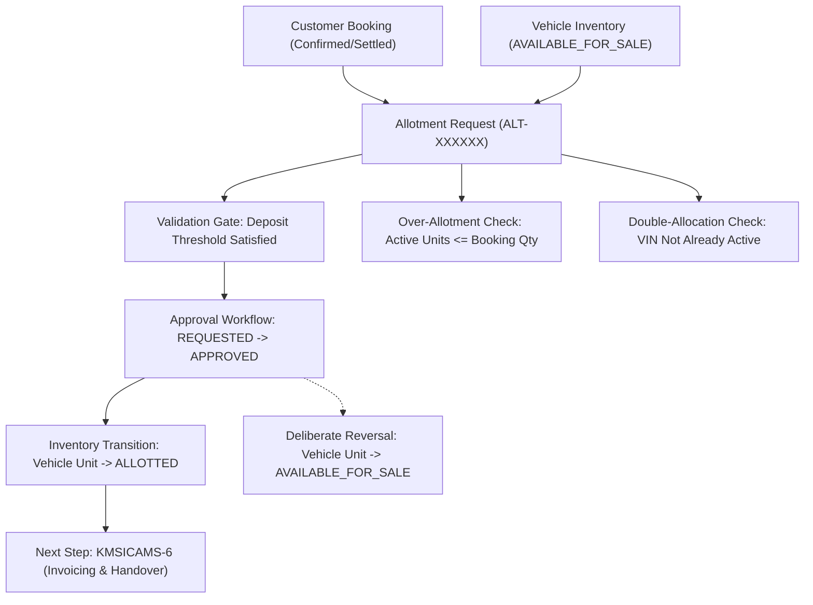

# KMSICAMS-5: Vehicle Allotment Management — Complete Acceptance & Testing Guide

> **Module:** Vehicle Allotment Management (KMSICAMS-5)  
> **Jira Ticket:** `KMSICAMS-5` · **Assignee:** Abel Legesse  
> **Tech Stack:** NestJS + TypeScript, PostgreSQL, TypeORM Migrations, React + TypeScript (Vite).

---

## 🏗️ Architecture & Business Rules Overview

In KMSICAMS-2, Customer Bookings and Deposit Thresholds were established. **KMSICAMS-5 (Vehicle Allotment Management)** connects those confirmed orders with physical inventory units (VIN / Chassis numbers).



### Key Business Rules & Guardrails
1. **Payment Validation Gate (BK1 & BK2):** An allotment request can only be submitted for bookings whose advance deposit threshold has been verified (`CONFIRMED` or `SETTLED`).
2. **Double-Allocation Defense (AL3 & IN1):**
   - **Layer 1:** Database unique index `uq_allotment_line_active_vehicle` on active lines (`is_active = true`).
   - **Layer 2:** Inventory state machine function `fn_transition_vehicle_status` preventing transition to `ALLOTTED` from unauthorized states.
3. **Over-Allotment Prevention (P1 & P2):** Row-level locking and trigger `fn_validate_allotment_quantity` guarantee that the sum of active allotted units cannot exceed the booking's ordered quantity.
4. **Deliberate Reversal / Un-Allotment (IN3):** Callable action `fn_reverse_allotment` seamlessly returns physical units to `AVAILABLE_FOR_SALE`, deactivates allotment lines, and transitions the allotment record to `CANCELLED`.

---

## 🧪 Detailed Test Cases (TC-A1 through TC-A12)

---

### TC-A1: Vehicle Allotment Schema & Sequence (`ALT-XXXXXX`)
* **Story AL1:** Allotment header table and sequence generator.
* **Goal:** Verify table `allotment` and sequence `allotment_number_seq`.
* **Steps:**
  1. Inspect table `allotment`.
  2. Inspect sequence `allotment_number_seq`.
* **Expected Result:** Generates allotment number formatted as `ALT-XXXXXX` (e.g. `ALT-000001`).

---

### TC-A2: Eligible Booking Selection & Payment Validation Gate
* **Story BK1 & BK2:** Filter bookings eligible for vehicle allocation.
* **Goal:** Verify endpoint `GET /api/allotments/eligible-bookings`.
* **Steps:**
  1. Open `http://localhost:5173` $\rightarrow$ **"Vehicle Allotments"** $\rightarrow$ Tab **"Eligible Bookings Queue"**.
  2. Verify bookings displayed have valid deposit status (`CONFIRMED` / `SETTLED`).
  3. Verify unconfirmed/draft bookings with unpaid deposits are excluded.
* **Expected Result:** Displays `BKG-000001` with customer, model, ordered quantity, and remaining unallotted count.

---

### TC-A3: Candidate Vehicle Units Availability & Model Matching
* **Story IN1 & AL4:** Filter vehicle units ready for allotment matching order item model.
* **Goal:** Verify endpoint `GET /api/allotments/available-vehicles?itemId=1`.
* **Steps:**
  1. In Allotment modal, observe candidate vehicles list.
* **Expected Result:**
  - Only displays units in `AVAILABLE_FOR_SALE` or `RESERVED` status.
  - Excludes units of different product models.
  - Surfaces VIN / Chassis number, Engine number, and warehouse.

---

### TC-A4: Double-Allocation Prevention (Layer 1 & Layer 2)
* **Story AL3:** Prevent allotting the same physical VIN to more than one active order.
* **Goal:** Verify unique constraint and server-side rejection.
* **Steps:**
  1. Attempt to create an allotment using a vehicle unit that is already active in an existing allotment.
* **Expected Result:**
  - Server returns HTTP 409 Conflict: *"Vehicle unit CHS-XXXX is already active in allotment ALT-XXXXXX"*.
  - Enforced by database unique index `uq_allotment_line_active_vehicle`.

---

### TC-A5: Over-Allotment Prevention (P1 & P2)
* **Story P1 & P2:** Prevent allotting more units than the booking ordered.
* **Goal:** Verify trigger `fn_validate_allotment_quantity`.
* **Steps:**
  1. On a booking requiring 2 units, attempt to select 3 units for allotment.
* **Expected Result:**
  - UI blocks selection past remaining needed count.
  - Server returns HTTP 400 Bad Request: *"Allotting 3 vehicle(s) exceeds booking's required quantity"*.

---

### TC-A6: Create Allotment Request API (`POST /api/allotments`)
* **Story AL1, AL2:** Submit new vehicle allotment into approval queue.
* **Goal:** Verify `POST /api/allotments`.
* **Steps:**
  1. In UI, click **"+ New Allotment Request"**.
  2. Select `BKG-000001` and select 1 or 2 available VINs (`CHS-BATCH-01`, `CHS-BATCH-02`).
  3. Submit request.
* **Expected Result:**
  - Returns HTTP 201 Created.
  - Allotment created in status `REQUESTED` with active lines for each VIN.

---

### TC-A7: Allotment Approval Workflow (`PATCH /api/allotments/{id}/approve`)
* **Story AP1:** Operations Manager approves allotment.
* **Goal:** Verify `PATCH /api/allotments/{id}/approve`.
* **Steps:**
  1. In Allotments table, click **"Approve"** on a `REQUESTED` allotment.
* **Expected Result:**
  - Status transitions to `APPROVED`.
  - `approved_by` and `approved_at` timestamps recorded.

---

### TC-A8: Inventory State Machine Transition (`AVAILABLE_FOR_SALE` $\rightarrow$ `ALLOTTED`)
* **Story IN2:** Approval locks physical inventory unit.
* **Goal:** Verify `fn_transition_vehicle_status`.
* **Steps:**
  1. After approving allotment, query `vehicle_unit` for the assigned chassis numbers.
* **Expected Result:**
  - `current_status` updates to `ALLOTTED`.
  - Vehicle is no longer available in the pool for new customer orders.

---

### TC-A9: Allotment Rejection Workflow (`PATCH /api/allotments/{id}/reject`)
* **Story AP1:** Reject allotment request with mandatory explanation.
* **Goal:** Transition status to `REJECTED` and release vehicle units.
* **Steps:**
  1. Click **"Reject"** on a `REQUESTED` allotment.
  2. Enter rejection reason: *"Vehicle unit designated for display showroom"*.
  3. Confirm rejection.
* **Expected Result:**
  - Status becomes `REJECTED`.
  - Allotment lines are deactivated; candidate vehicles remain available for other bookings.

---

### TC-A10: Un-Allotment / Reversal Workflow (`PATCH /api/allotments/{id}/reverse`)
* **Story IN3:** Deliberate cancellation of an approved allotment.
* **Goal:** Revert vehicle units to `AVAILABLE_FOR_SALE`.
* **Steps:**
  1. Click **"Un-allot / Revert"** on an `APPROVED` allotment.
  2. Confirm reversal.
* **Expected Result:**
  - Status becomes `CANCELLED`.
  - Vehicle units revert from `ALLOTTED` back to `AVAILABLE_FOR_SALE`.
  - Allotment lines deactivated with `deactivated_at` timestamp.

---

### TC-A11: Partial Allotment Tracking & Booking Progress
* **Story P2, P3:** Booking progress tracking across multiple allotments.
* **Goal:** Verify partial allotment support.
* **Steps:**
  1. For a 2-unit booking, allot and approve 1 unit first.
  2. Observe **Eligible Bookings Queue**:
     - Allotted: `1 / 2`
     - Remaining Needed: `1`
     - Progress bar updates to `50%`.
  3. Later allot the remaining 1 unit.
* **Expected Result:** Booking transitions to fully allotted (`2 / 2`).

---

### TC-A12: Frontend Vehicle Allotment UI & Operations Interface
* **Story U1, U2:** Complete user interface verification.
* **Goal:** Verify interface at `http://localhost:5173` $\rightarrow$ **"Vehicle Allotments"**.
* **Steps:**
  1. Navigate to `http://localhost:5173`.
  2. Click **"Vehicle Allotments"** in the sidebar.
  3. Test full lifecycle: New Allotment Request $\rightarrow$ Approve $\rightarrow$ Un-Allot / Revert.
* **Expected Result:** Real-time updates, clear badge feedback, and responsive layout.

---

## 🚀 Quick Verification Command Reference

```powershell
# 1. Run all backend unit tests (includes KMSICAMS-5 allotment constraints)
cd d:\kanab\backend
npm test -- allotments.service.spec.ts

# 2. Run full test suite across all modules (24 tests)
npm test

# 3. Verify backend compilation
npm run build

# 4. Verify frontend production build
cd d:\kanab\frontend
npm run build
```
